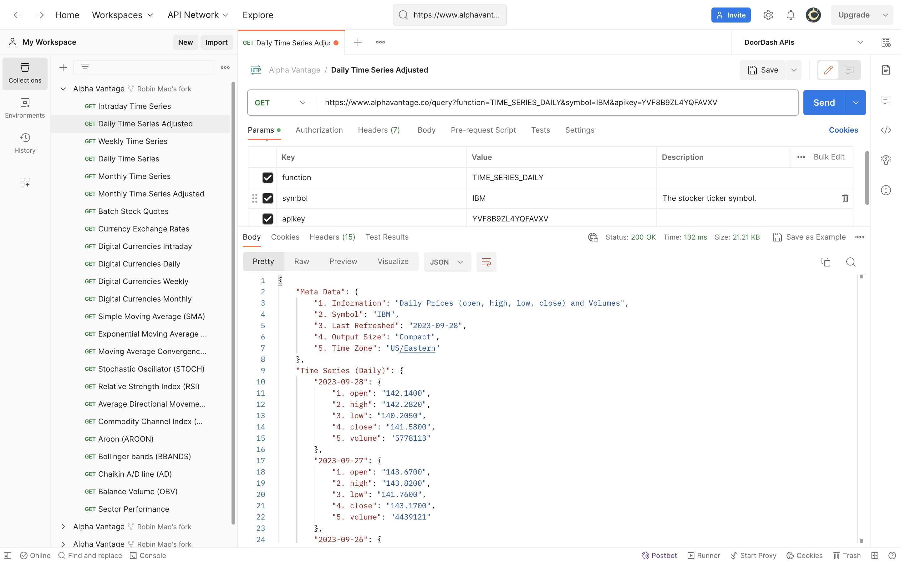
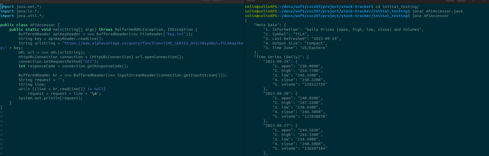

# Stock Tracker

### Credit:
- Chenxu Robin Mao, robin.mao@mail.utoronto.ca
- Jarod Palubiski, jarod.palubiski@mail.utoronto.ca
- Colin Walton, colin.walton@mail.utoronto.ca
- Abdulrahman Mubarak, Abdulrahman.mubarak@mail.utoronto.ca

---

## Problem Domain

Our program will serve the purpose of tracking the stock market, provide users with detailed daily stock market 
formation. In the future, it may have a stock simulation mode that tracks a hypothetical stock portfolio overtime for
people who want to understand the stock market without spending any actual money.

## Application Description

The application will be a java swing application that can be used to track stocks and stock portfolios. 
The user will be able to view quotes (updated from API), as well as simulate deposits, withdrawal, buys, and sells.

## API Documentation Link

|| https://www.alphavantage.co/documentation/

The suggested API is from Alpha Vantage, It's possible to change in the future without losing the functionality of the program.

## Screenshot of API from Hoppscotch

## Java code

Running initial_testing/APIAccessor.java retrieves data on TSLA daily share prices from the last 100 trading days. An API key from Alpha Vantage placed on the first line of initial_testing/key.txt is required. A screenshot of the result of running APIAccessor is included here.

## Screenshot of API from Java

